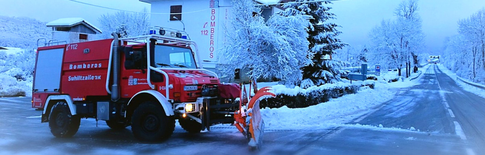
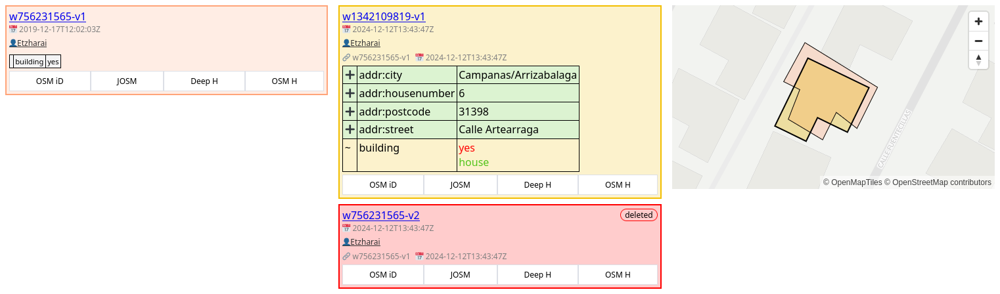
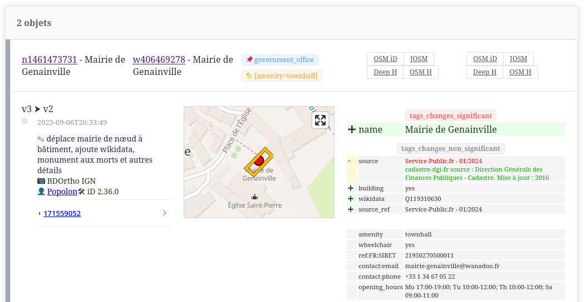

## Clearance, OSM Logical History and Underpass API

OSM Data Replication under Quality Constraints

## SotM EU 2025

Frédéric Rodrigo - Teritorio

frederic@teritorio.fr

---

## Context

- Contribution to OSM as a main business database
- Quickly deploy changes from OSM
- Ensure the quality of provided data

e.g. Local government (POIs), Civil defense (road network)

----

## Needs

### QA OSM changes
- QA focused on business OSM objects
- Minimize human review workload
- Comprehensive changes
- Work at the OSM data level: use OSM tools

### Deploy changes quickly when possible
- Changes outside the area or thematic focus
- Coherence and reliability of partial changes

---

## Existing QA Tools

- Check State Before Contributions
  - JOSM Validator

- Check State After Contributions
  - Keep Right, OSM Inspector, Osmose-QA*

- Check Changes After Contributions
  - OSMCha

---

Another Way

# Check Before Replication

---

## Quality, Replication and API

The quality of incoming OSM updates is never known

Filter changes

---

## Replication, Data Update

- Database, Import
  - OSM Extract
  - Save incoming Diff without applying
- Check update Quality
  - OK ⇒ Apply changes
  - Not OK ⇒ Hold on
    - Fix in OSM
    - Wait for the next OSM update to be OK

Invariant: Quality is only increasing

----

### Partial Replication, LoCha

LoCha: Local Changeset

Clustered sum of changes

Apply Quality Checks locally
- Hold on locally
- Let others pass ⇒ deploy updates quickly

---

## Quality - Validation Rules

- Check changes between
  - last sync object versions
  - and held incoming changes
- Check using tags, geometry, metadata, changeset...
- Check object changes individually or in groups

----

## Rule Examples

- Geometry moved > 10 m
- Blacklisted tags or users
- Changes by a new contributor
- Force manual review (e.g. defibrillator deletion)
- Hold on “hot” changes:
  - still being updated
  - edit wars / vandalism
- Road network continuity must remain (TODO)
- Contributions should not duplicate POIs (TODO)

---

## OSM Local History

Comprehensive changes

Apply rules at semantic level

### Conflation between
- last synchronized object versions
- and held incoming changes

### Is it a business change or not?
- Moving tags from node to way
- Splitting / merging on way or area

----

## OSM Local History - As a Tool

https://teritorio.github.io/openstreetmap-logical-history-component/

Review OSM changes at semantic level [Demo](https://teritorio.github.io/openstreetmap-logical-history-component/?date_start=2024-12-09T23:00:00.000Z&date_end=2024-12-14T23:00:00.000Z&bbox=-1.6537454710167148,42.685107065011486,-1.6509720668953156,42.68686379572838)

---

## Clearance
## as OSM Data Proxy

### Standard Output
- OSM PBF Extract
- Diff update
  - according to validation order

### Acts as Overpass
- Overpass-like API to access sync DB

---

## Underpass API
### Overpass to SQL

Why?
- Overpass API: the standard way to extract data
- Clearance: many partially synchronized DBs
  - avoids managing multiple Overpass instances
- Building Overpass for SQL DBs is a nice challenge

https://github.com/teritorio/overpass_parser_rust

Partial Overpass language support

----

### Underpass API

Multiple SQL dialects / OSM database schemas
- Postgres/PostGIS, OPE or Osmosis (Clearance)
- DuckDB/Spatial, Quackosm (Embedded Column DB)

### As a Tool
- Server-side
- Browser-side (WASM – yes, it works)
  - Execute in the browser
  - Partial Parquet download via HTTP byte ranges

https://github.com/teritorio/Underpass-API

---

## Clearance

1. Sync OSM data from diff
2. Sum changes + Rearrange as local
3. Build Semantic Conflation
4. Validation
5. Sync or reject
6. Export + Underpass

----

## Clearance

https://github.com/teritorio/clearance

Demo [clearance.teritorio.xyz](https://clearance.teritorio.xyz)

---

## Clearance

OSM Extracts sync only with qualified changes

Ask for a new project on our demo instance

- https://clearance.teritorio.xyz
- https://teritorio.github.io/openstreetmap-logical-history-component/
- https://github.com/teritorio/Underpass-API

----

## Clearance

`takeaway=slides`

https://s.carto.guide/djamig

